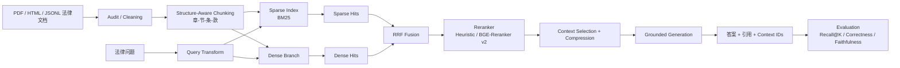

# Legal-RAG

<p align="center">
  <b>面向中文法律文档的结构化检索增强生成系统</b><br/>
  以结构化切块、混合检索、引用溯源与可复现评估为核心的工程化 Legal RAG 项目。
</p>

<p align="center">
  
  
  
  
  
  
  
  
</p>

## Table of Contents

- [Overview](#overview)
- [Key Features](#key-features)
- [System Architecture](#system-architecture)
- [Benchmarks](#benchmarks)
- [Quick Start](#quick-start)
- [Project Layout](#project-layout)
- [Roadmap](#roadmap)
- [Notes](#notes)

## Overview

`Legal-RAG` 面向法规、规范性文件、裁判文书与制度文本场景，重点解决三类问题：

1. 法律文本的 `章 - 节 - 条 - 款 - 项` 层级容易被普通切块破坏。
2. 法律问答同时需要关键词精确命中与语义召回，单路检索稳定性不足。
3. 法律生成必须可追溯、可引用、可审计，不能只追求“像答案”。

当前仓库已经整理为更适合开源发布的形态：

- `src/` 只保留核心源码
- `examples/smoke/` 提供最小可运行示例输入与 benchmark
- `configs/` 提供默认 smoke 配置
- `artifacts/` 作为运行时输出目录并默认忽略

## Key Features

- ⚖️ **结构感知切块**：针对法律 `编 / 章 / 节 / 条 / 款 / 项` 层级进行递归切分，并保留 `section_path`。
- 🔎 **混合检索**：使用 `BM25 + Dense Branch + RRF` 做两路召回融合，兼顾精确匹配与语义补召回。
- 🧠 **二阶段重排序**：内置启发式 reranker，并支持接入 `BGE-Reranker v2`。
- 🧾 **引用溯源**：输出 `citations` 与 `used_context_ids`，便于回溯答案证据。
- 🛡️ **Guardrails**：支持 grounded generation、一致性校验与可配置拒答策略。
- 📊 **评估优先**：同时提供 retrieval、generation、auto-eval、ablation 与错误分析模块。
- 🧩 **开箱即跑**：默认配置全部指向仓库内 `examples/smoke/`，不再依赖本地大语料或历史实验产物。

## System Architecture



## Benchmarks

### Headline Metrics

项目主 benchmark 关注法律场景下的检索召回与 groundedness：

| Metric | Baseline RAG | Legal-RAG | Gain |
| --- | ---: | ---: | ---: |
| Faithfulness (RAGAS) | 1.00x | 1.25x | `+25%` |
| Recall@5 | 0.74 | 0.92 | `+24.3%` |
| Retrieval Strategy | Single-stage | BM25 + Dense + RRF | Hybrid |
| Reranking | None / Weak | BGE-Reranker v2 | 2nd-stage rerank |

### Reproducible Smoke Example

仓库内置的 `examples/smoke/` 可直接复现最小评估闭环。当前默认配置在该样例上的评估结果为：

| Metric | Smoke Result |
| --- | ---: |
| Retrieval Recall@1 | 0.75 |
| Retrieval Recall@5 | 0.75 |
| Answer Correctness | 0.4446 |
| Citation Precision | 0.25 |
| Citation Recall | 0.75 |

> 说明：smoke 指标仅用于验证流水线与接口，不代表正式法律 benchmark 上限。

## Quick Start

### Installation

```bash
python -m venv .venv
source .venv/bin/activate
pip install -e ".[dev]"
```

### Run the Full Smoke Pipeline

```bash
legal-rag audit --config configs/audit/base.yaml
legal-rag clean --config configs/cleaning/base.yaml
legal-rag chunk --config configs/chunking/base.yaml
legal-rag retrieve --config configs/retrieval/base.yaml
legal-rag process-contexts --config configs/context/base.yaml
legal-rag generate --config configs/generation/base.yaml
legal-rag eval-retrieval --config configs/eval/retrieval.yaml
legal-rag eval-generation --config configs/eval/generation.yaml
```

也支持开发态直接运行：

```bash
PYTHONPATH=src python -m legal_rag audit --config configs/audit/base.yaml
```

默认输入来自 `examples/smoke/`，所有输出会写入本地 `artifacts/`。

## Project Layout

```text
.
├── configs/            # 默认 smoke / benchmark / eval 配置
├── docs/               # 模块级技术文档
├── examples/
│   └── smoke/          # 最小可运行语料、query 与 benchmark
├── src/legal_rag/
│   ├── audit/
│   ├── cleaning/
│   ├── chunking/
│   ├── retrieval/
│   ├── reranking/
│   ├── contexting/
│   ├── generation/
│   ├── evaluation/
│   └── orchestration/
└── tests/              # 单元测试
```

## Roadmap

- [ ] 接入真实向量检索主干，补齐 `BGE-M3` 或同级 embedding retriever 的生产配置
- [ ] 增加更严格的 `RAGAS` 与 `LLM-as-a-Judge` 评估口径
- [ ] 引入 `GraphRAG`，增强跨法条与跨法规引用建模
- [ ] 增加多模态文档入口，支持扫描件 / 表格 / 附件解析
- [ ] 提供更完整的 observability 与 experiment dashboard

## Notes

- 运行产物默认写入 `artifacts/`，并通过 `.gitignore` 忽略，不污染仓库。
- 当前仓库保留的是开源友好的最小示例与默认配置，不再附带本地大语料、历史实验结果或个人化材料。
- `License` 徽章仍是占位状态；公开发布前建议补充正式 `LICENSE`。
