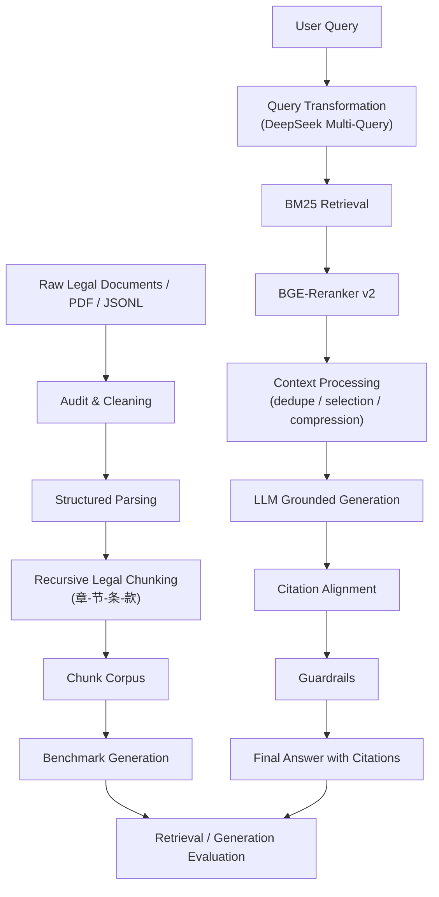

<div align="center">

# Legal-RAG

**面向中文法律文档的结构化检索增强生成系统**

一个聚焦**中文法律 / 政策文档**的 RAG 工程实践：从结构化切块、检索增强、精排、引用生成到自动化评估，**可复现、可解释、可对比**。

<p>
  
  
  
  
</p>

</div>

---

## Overview

**Legal-RAG** 是一个面向**中文法律与政策文本**的结构化 RAG 系统，重点解决以下问题：

- 法律文本层级复杂，普通固定切块容易破坏条文边界
- 用户问题通常口语化，与正式法律术语存在语义鸿沟
- 检索结果必须服务于**有据可查**的回答，而不是仅追求语义相似
- 法律场景对幻觉容忍度低，需要引用、拒答和一致性约束

---

## Key Features

- ⚖️ **结构化法律切块**
  - 针对“章-节-条-款-项”层级做结构感知切分，尽量保留法律语义单元
- 🔍 **法律检索增强**
  - 基于 **BM25** 做主检索，并在检索前加入 **DeepSeek Multi-Query**
- 🧠 **Cross-Encoder 精排**
  - 使用 **BGE-Reranker v2** 对候选片段重排序，提升前排命中质量
- 🧾 **Grounded Generation**
  - 生成答案时绑定 `used_context_ids` 与引用编号，输出可溯源答案
- 🛡️ **轻量 Guardrails**
  - 支持引用格式校验、上下文一致性检查、证据不足时拒答
- 📊 **自动化评估**
  - 支持 benchmark 生成、检索/生成评测、配置化 ablation
- 🧪 **法律场景实验闭环**
  - 对比了 BM25、Multi-Query、HyDE、Reranker、Extractive、LLM Generation

---

## System Architecture



---

## Design Notes

### 1. Structured Chunking for Legal Text

法律文本具有明显的规范层级结构。项目使用结构感知切块，优先保留：

- 编 / 章 / 节
- 条
- 款 / 项
- 标题与条文前导信息

### 2. Why the Final Retrieval Stack Is BM25-Centered

本项目早期也实现了 dense / hybrid baseline，但当前 dense 检索器仍是**research-style in-memory baseline**，不是 ANN / 向量数据库方案。  
因此在更大规模实验上，最终主线选择了：

- **BM25**：作为稳定主检索
- **Multi-Query**：解决口语化问题与法律术语之间的表达差异
- **BGE-Reranker v2**：提升 Top-K 排序质量

这条路线更贴合当前实现边界，也更适合做可复现 benchmark。

### 3. Why HyDE Was Removed

在本项目 benchmark 上，**HyDE** 没有带来正收益，反而让 `Recall@3 / Recall@5 / MRR` 下降。  
一个合理解释是：法律文本对术语边界、责任概念、程序表达很敏感，HyDE 生成的伪答案容易引入分布偏移，因此最终保留了 **Multi-Query**，去掉了 **HyDE**。

### 4. Retrieval First, Then Generation

项目优化顺序：

1. 先建检索链路
2. 再做 context processing
3. 最后对比 extractive 与 grounded generation

---

## Benchmarks

### Retrieval Benchmark

> Benchmark size: **525** legal QA samples

#### Full Benchmark (strict)

| Variant | Recall@5 | MRR | Precision@5 | nDCG@5 |
|---|---:|---:|---:|---:|
| BM25 | 0.4933 | 0.3396 | 0.0998 | 0.3778 |
| BM25 + MQ3 | 0.4952 | 0.3410 | 0.1002 | 0.3794 |
| **BM25 + MQ3 + BGE-Reranker** | **0.5781** | **0.4511** | **0.1170** | **0.4827** |

#### Answerable-Only Benchmark

| Variant | Recall@5 | MRR | Precision@5 | nDCG@5 |
|---|---:|---:|---:|---:|
| BM25 | 0.5570 | 0.3834 | 0.1127 | 0.4265 |
| BM25 + MQ3 | 0.5591 | 0.3850 | 0.1131 | 0.4284 |
| **BM25 + MQ3 + BGE-Reranker** | **0.6527** | **0.5094** | **0.1320** | **0.5449** |

#### Retrieval Takeaways

- **Multi-Query** 带来小幅正收益
- **HyDE** 为负收益，移除
- **BGE-Reranker** 是最大的单点提升来源
- 在 `answerable` 子集上，最终检索链路相对 BM25 baseline 提升为：
  - `Recall@5`: `+0.0957`
  - `MRR`: `+0.1260`
  - `Precision@5`: `+0.0193`
  - `nDCG@5`: `+0.1184`

#### Retrieval by Question Type

| Question Type | Count | Recall@5 | MRR | Precision@5 | nDCG@5 |
|---|---:|---:|---:|---:|---:|
| Definition | 120 | 0.9250 | 0.8540 | 0.1850 | 0.8718 |
| Comparison | 100 | 0.8350 | 0.6690 | 0.1740 | 0.7095 |
| Condition | 100 | 0.6800 | 0.4303 | 0.1360 | 0.4927 |
| Procedure | 70 | 0.3429 | 0.2076 | 0.0686 | 0.2414 |
| Responsibility | 75 | 0.2267 | 0.1320 | 0.0453 | 0.1555 |
| Unanswerable | 60 | 0.0000 | 0.0000 | 0.0000 | 0.0000 |

这表明系统对**定义类**和**比较类**法律问题的表现最强，而**程序类**与**责任类**问题仍然是主要难点。

---

### Generation Benchmark

> 基于最优检索链路：`BM25 + MQ3 + BGE-Reranker`

| Variant | Answer Correctness | Citation Precision | Citation Recall | Abstain Accuracy |
|---|---:|---:|---:|---:|
| Extractive Raw | 0.2995 | 0.1781 | 0.5495 | 0.8114 |
| Extractive Processed | 0.3182 | 0.1935 | 0.5000 | 0.8114 |
| Extractive Processed Loose | 0.3049 | 0.1934 | 0.5000 | 0.8114 |
| LLM Processed | 0.3647 | 0.3286 | 0.3629 | 0.7790 |
| **LLM Processed Wide** | **0.3679** | **0.3354** | **0.3686** | **0.7886** |

#### Generation Takeaways

- `processed context` 对 extractive baseline 有稳定帮助
- 简单放宽 extractive 句子数并没有继续提升效果
- **LLM grounded generation** 在 `answer_correctness` 与 `citation_precision` 上明显优于 extractive
- 扩大上下文窗口后，`LLM Processed Wide` 成为最终最优生成方案

---

## Final Stack

### Retrieval

- **BM25**
- **DeepSeek Multi-Query**
- **BGE-Reranker v2**

### Generation

- **Processed Contexts**
- **LLM Grounded Generation**
- **Wide Prompt Context Window**

---

## Quick Start

### Installation

```bash
git clone https://github.com/yourname/legal-rag.git
cd legal-rag

python -m venv .venv
source .venv/bin/activate
pip install -e ".[dev]"
```

### 1. Audit & Clean

```bash
python -m legal_rag.cli.main audit --config configs/audit/base.yaml
python -m legal_rag.cli.main clean --config configs/cleaning/base.yaml
```

### 2. Chunk Legal Documents

```bash
python -m legal_rag.cli.main chunk --config configs/chunking/base.yaml
```

### 3. Run Retrieval

```bash
python -m legal_rag.cli.main retrieve --config configs/retrieval/base.yaml
python -m legal_rag.cli.main eval-retrieval --config configs/eval/retrieval.yaml
```

### 4. Process Contexts & Generate Answers

```bash
python -m legal_rag.cli.main process-contexts --config configs/context/base.yaml
python -m legal_rag.cli.main generate --config configs/generation/base.yaml
python -m legal_rag.cli.main eval-generation --config configs/eval/generation.yaml
```

### 5. Benchmark & Validation

```bash
python -m legal_rag.cli.main generate-benchmark --config configs/benchmark/generate_v1.yaml
python -m legal_rag.cli.main validate-benchmark --config configs/benchmark/validate.yaml
```

---

## Example Experiment Configs

This repository includes interview/demo-oriented configs for:

- `configs/retrieval/legal_corpus_bm25_qt/`
- `configs/retrieval/legal_corpus_bm25_rerank/`
- `configs/context/legal_corpus_generation/`
- `configs/generation/legal_corpus/`
- `configs/eval/legal_corpus_generation/`

These configs correspond to the benchmark results summarized above.

---

## Project Goals

- 为中文法律 RAG 提供一个**可复现、可评估、可解释**的工程基线
- 在法律场景中平衡：
  - 检索覆盖率
  - 前排精度
  - 引用可靠性
  - 拒答行为
- 用 benchmark 驱动方法选择

---

## Roadmap

- [x] 结构化法律切块
- [x] BM25 检索基线
- [x] Query Transformation（Multi-Query / HyDE）
- [x] BGE-Reranker 精排
- [x] Grounded Generation + Citation Alignment
- [x] Benchmark Generation / Validation / Ablation
- [ ] 用真正向量索引替换 research dense baseline
- [ ] 更强的法律领域 reranker / judge
- [ ] 更大规模 benchmark 与自动化评测闭环

---
